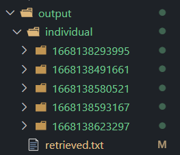
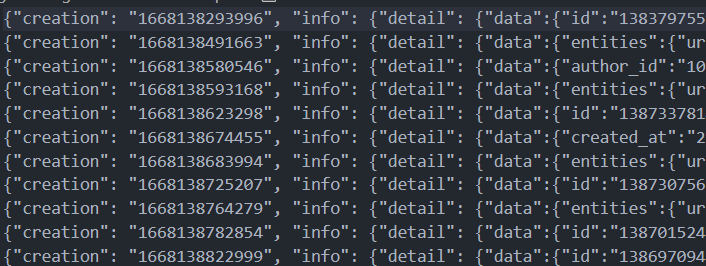

# twitter-postscaper
 Twitter post scaper. For personal use only project.
 
## Description
 This was made for saving an account before deletion only. To avoid repeatance of copying a post and pasting it to notepad, this program automates copying and pasting for you. Output will be a text file contains the data and a json file where every post that has been loaded will be stored.
 This also uses Twitter API so if you'll use this one, you'll be required to make an account from [Twitter Developer](https://developer.twitter.com/en) website to have the keys and token.

## Instruction for installation
Make sure that you've node.js on your machine.

 1. Download as zip and extract it to your folder.
 2. Open this folder to you code editor.
 3. Open terminal and run `npm i`
 4. Go to your Twitter Developer account and copy the BEARER TOKEN
 5. After copying the BEARER TOKEN, open the file server.js then paste it to the BEARER variable.
 6. After pasting. You can now start the server by using `npm run dev` in the terminal.
 7. Go to your browser and type `http://localhost:8000`
 8. Enjoy!

## Instruction for usage
To use the program. You need to copy the the of the tweet post.

To visualize:
This is the link of a tweet.
`https://twitter.com/official_izone/status/1383797558326161409`

You need to copy the last part of the link.
`1383797558326161409`

Then paste it to the search input the click the search button.

## Languages and dependencies
 - node
 - css
 - express
 - axios
 - ejs
 - fs
 - path
 
 ## Output

Output breakdown:
- output folder is the main folder for output (lol)
- retrieved.txt file stores the retrived post and saves it to a JSON format. This file can be converted to a JSON by removing the `,` in the last part of the text and putting `[` to the beginning and `]` to the end.

- folders with number name. This folders are named using JavaScript `new Date().getTime()`. 
